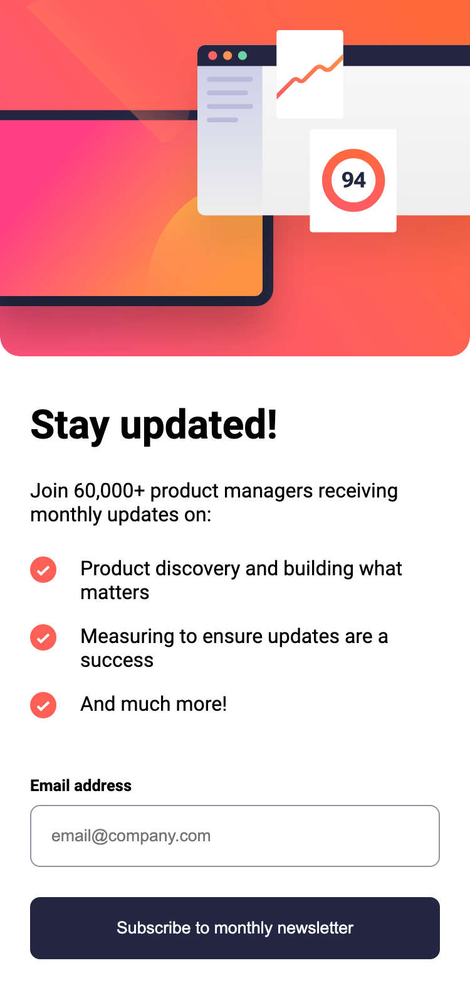

# Frontend Mentor - Newsletter sign-up form with success message solution

This is a solution to the [Newsletter sign-up form with success message challenge on Frontend Mentor](https://www.frontendmentor.io/challenges/newsletter-signup-form-with-success-message-3FC1AZbNrv). Frontend Mentor challenges help you improve your coding skills by building realistic projects.

## Table of contents

-   [Overview](#overview)
    -   [The challenge](#the-challenge)
    -   [Screenshot](#screenshot)
    -   [Links](#links)
-   [My process](#my-process)
    -   [Built with](#built-with)
    -   [What I learned](#what-i-learned)
    -   [Continued development](#continued-development)

## Overview

### The challenge

Users should be able to:

-   Add their email and submit the form
-   See a success message with their email after successfully submitting the form
-   See form validation messages if:
    -   The field is left empty
    -   The email address is not formatted correctly
-   View the optimal layout for the interface depending on their device's screen size
-   See hover and focus states for all interactive elements on the page

### Screenshot




### Links

-   Solution URL: [Add solution URL here](https://your-solution-url.com)
-   Live Site URL: [Add live site URL here](https://your-live-site-url.com)

## My process

### Built with

-   Semantic HTML5 markup
-   CSS custom properties
-   Flexbox
-   Mobile-first workflow

### What I learned

I gained a clear understanding of how to write code for a form without relying on third-party libraries. This experience helped me learn the underlying mechanics of form functionality.

```html
<form id="form" aria-labelledby="email-form" novalidate>
    <div class="email-label">
        <label for="email">Email address</label>
        <div class="email-error-message" aria-live="polite"></div>
    </div>
    <input
        id="email"
        name="email"
        type="email"
        placeholder="email@company.com"
    />
    <button type="submit">Subscribe to monthly newsletter</button>
</form>
```

```css
.email-error-message {
    color: var(--color-primary-tomato);
    font-size: 0.8rem;
    font-weight: var(--font-weight-700);
}
```

```js
const handleSubmit = (e) => {
    e.preventDefault();

    const formData = new FormData(e.target);
    const { email } = Object.fromEntries(formData);

    const errorMessage = validateEmail(email);

    if (errorMessage) {
        const emailErrorElement = document.querySelector(
            ".email-error-message"
        );
        emailErrorElement.innerText = errorMessage || "";
    } else {
        window.location.href = "success.html";
    }
};
```

### Continued development

I plan to continue learning about different form inputs and their validation techniques, as well as how to pass actual data to the server. Additionally, I encountered challenges with adjusting images based on device sizes, so I aim to improve and apply this skill in future projects.
# newsletter-sign-up-with-success-message-main
